# Komentowanie i poroponowanie zmian

Nie jestem specjalistą w temacie, a w wielu miejscach nawet wprost proszę o kontakt, jeżeli ktoś portrafi odnieść się do moich wątpliwości, zatem pozwolę sobie opisać sposób w jaki to można zrobić. Generalnie zakładam, że wszystko to może zostać zrealizowane przez GitHuba.

???+ abstract "Dla obeznanych z GitHubem"
    W skrócie zasady są takie:

    1. Przewiduję raczej jako Issue (nazywam to wszędzie potem _zgłoszeniem_), ale w ostateczności może być i "Pull Request". Chociaż w takim wypadku raczej lepiej by było i tak utworzyć issue, by osoby mniej obeznane wiedziały, że coś się w temacie dzieje.
    2. Bardzo proszę o sprawdzanie tego, co już wisi, żeby nie dublować tematów (chociaż nie będzie to tragedia).
    3. W opisie bym prosił o podanie, której strony dotyczy zgłoszenie. Niżej jest sekcja "Jak znaleźć adres strony?" - tam jest skrin, który chyba wszystko tłumaczy, o co mi chodzi.
    4. Zgłoszenia w miarę możliwości po polsku, żeby wszyscy rozumieli. Jakby ktoś umiał słabo polski (w sumie wtedy pytanie, jakim cudem to rozumie xd), to wtedy można też w innym języku, to spróbujemy przetłumaczyć.

Sam GitHub jest przede wszystkim platformą dla programistów i służy do przechowywania i synchronizacji pracy nad kodem. Nie mniej jednak ostatecznie zdecywoałem się na tą platformę, ponieważ tutaj najłatwiej mogę udostępnić teksty jako stronę internetową, mając od razu zapewnione możliwości komentowania i proponowania zmian w tekstach przez inne osoby.

!!! note
    Chciałbym, żeby możliwość interakcji ze mną była możliwa dla jak najszerszej grupy odbiorców - nawet osób tzw. "nietechnicznych". Pewne kwestie wydają się mi (i zapewne nie tylko mi) oczywiste, ale wolę napisać więcej niż mniej. Dlatego opis ten jest bardzo szczegółowy i rozbudowany. Na początku rozdziałów dodałem wstawkę w sekcjach "Abstract".

## Zakładanie konta

!!! abstract
    Założenie konta na GitHubie jest darmowe i wymaga właściwie tylko adresu mailowego do podania.

Na początku należy otworzyć stronę rejestracji GitHub: [https://github.com/signup](https://github.com/signup).

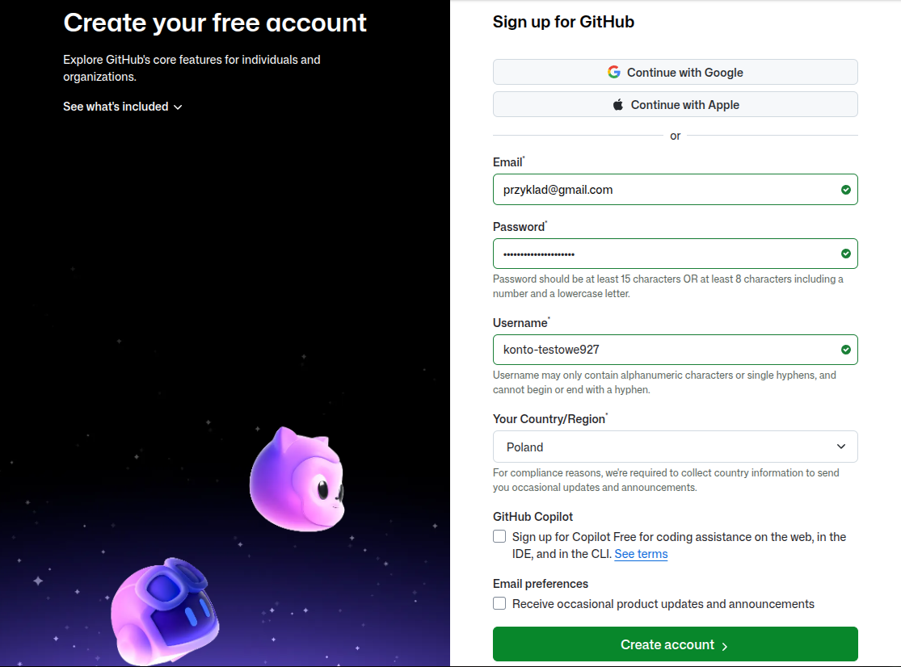

Na stronie tej należy kolejno podać:

* swój adres mailowy
* wymyślone przez siebie hasło
* wymyśloną przez siebie nazwę użytkownika - musi być różna od wszystkich dotychczasowych użytkowników portalu, więc znalezienie odpowiedniej nazwy może zająć nieco czasu. Co więcej, na dzień dzisiejszy w nazwach dopuszczalne są jedynie znaki alfabetu łacińskiego (nie można użyć znaków diakrytycznych np. ą, ę itd.), liczby oraz pauzy/minusy, z tymże te ostatnie nie mogą występować ani na pierwszym, ani na ostatnim miejscu nazwy.
* Kraj - zapewne Polska (Poland)

Dwa okienka (checkboxy) na dole można w razie wątpliwości zostawić odznaczone, szczególnie jeżeli nie planuje się używać konta GitHub do niczego innego.

Po kliknięciu przycisku "Create account" powinien pojawić się ekran z polem do wpisania kodu weryfikacyjnego. System powinien wysłać wiadomość z nim na podany adres mailowy, choć o może potrwać do kilku minut. Na dzień dzisiejszy składa się on z 6-ciu cyfr. Kod ten należy w prowadzić do tego pola i ewentualnie kliknąć klawisz "enter".

???+ failure "Co gdy kod nie przyjdzie na maila?"
    Po chwili od pokazania się ekranu z polem do wpisania kodu weryfikacyjnego (chyba koło minuty) na stronie powinien się pojawić pod polem do wpisania kodu weryfikacyjnego przycisk z napisem np. "Resend code". Warto go wtedy kliknąć, bo to powinno wywołać ponowne wysłanie kodu. Gdyby i to nie pomogło, to warto spróbować zrobić wszystko od początku np. następnego dnia.

Po pomyślnym logowaniu powinien pojawić się ekran logowania.

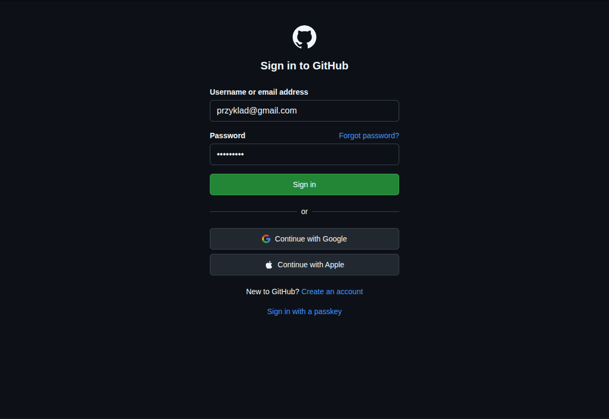

Tam należy wprowadzić podane wcześniej: adres mailowy i hasło. Po kliknięciu przycisku "Sign in" powinna zostać wyświetlona strona domowa GitHuba.

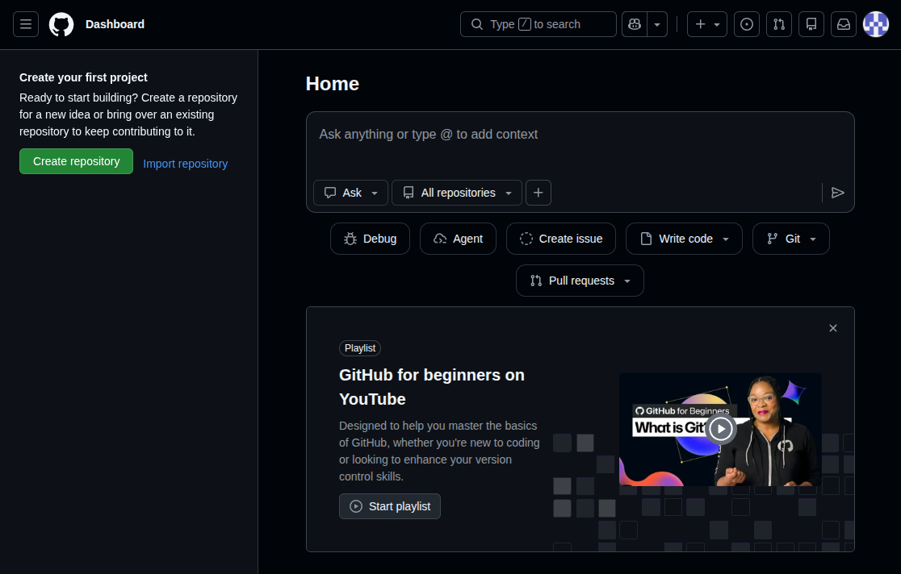

## Zgłaszanie problemu

W związku z tym, że nie zakładam szybkiego wzrostu zainteresowania blogiem, wydaje mi się, że najwygodniejszą formą komunikacji będą "issues" (zwanych dalej _zgłoszeniami_). Sama koncepcja oryginalnie zakłada możliwość zgłaszania problemów dotyczących programów bez odnoszenia się do kodu źródłowego, w związku z czym sprowadza się właściwie do wpisania pojedynczego fragmentu tekstu.

Aby to zrobić należy wejść na stronę repozytorium GitHub projektu: [https://github.com/kodziarz/drobnoustroj](https://github.com/kodziarz/drobnoustroj).

!!! info
    W tym miejscu znajdują się pliki źródłowe projektu, które można swobodnie przeglądać. Część z nich ma znaczenie czysto techniczne (np. konfiguracja strony w pliku mkdocs.yml), jednak w folderze "docs" znajdują się już pliki zawierające właściwi tekst bloga.

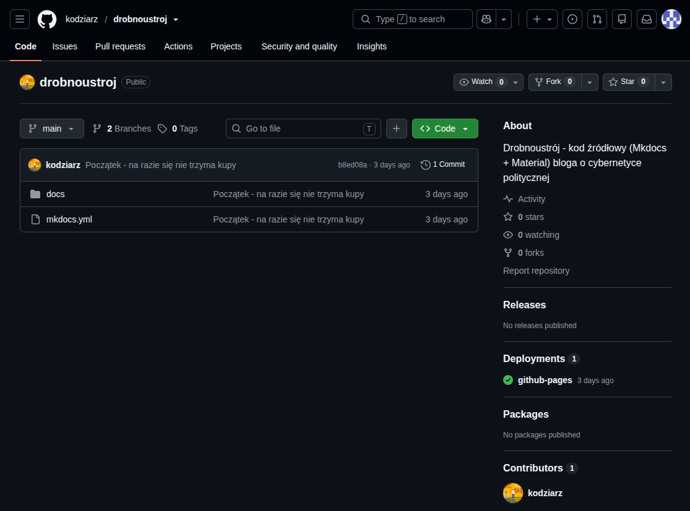

Aby dodać zgłoszenie należy kliknąć zakładkę "Issues" na w górnej części ekranu.

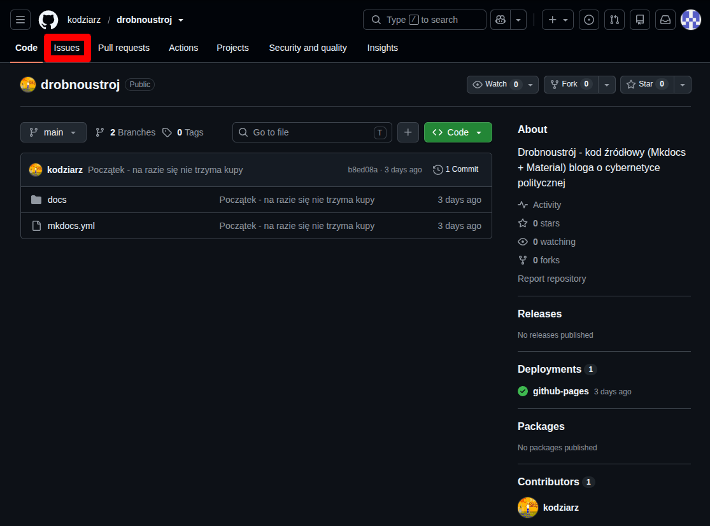

Wtedy wyświetli się strona zawierająca listę dochczasowych zgłoszeń. Na obrazku w tym miejscu widnieje napis "No results", poniważ wtedy nie było jeszcze żadnych zgłoszeń. Na tym etapie warto zweryfikować, czy zaganienie, które zamierza się zgłosić, nie zostało już przez kogoś zgłoszone - wówczas nie ma potrzeby tego robić.

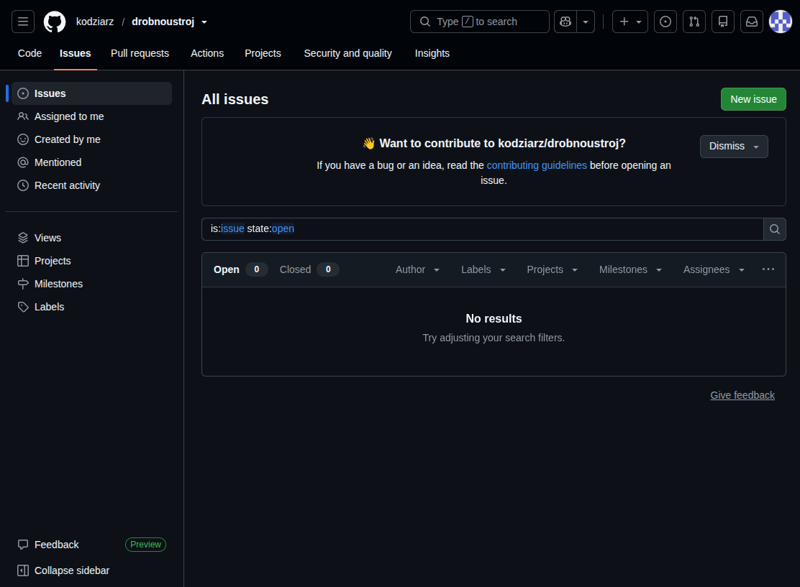

Dodanie nowego zgłoszenia rozposzyna się od kliknięcia przycisku "New issue". Na dzień dzisiejszy jest to zielony przycisk znajdujący się w prawym górnym rogu.

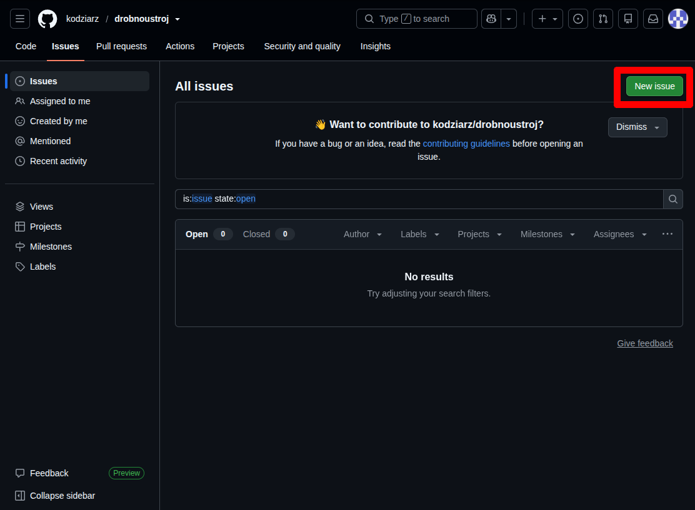

Po jego kliknięciu pokaże się strona tworzenia zgłoszenia.

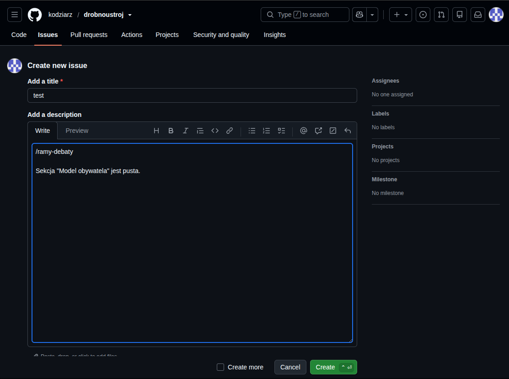

Na stronie tej należy wprowadzić:

* tytuł zgłoszenia
* opis zgłoszenia

W przypadku opisu warto w pierwszej linii napisać adres strony, której dotyczy zgłoszenie.

???+ question "Jak znaleźć adres strony?"
    Najłatwiej w nowej karcie otworzyć bloga (pod adresem: [https://kodziarz.github.io/drobnoustroj](https://kodziarz.github.io/drobnoustroj/)) i tam znaleźć stronę, do której tekstu chce się odnieść.

    !!! tip "Jak otworzyć nową kartę?"
        Najłatwiej skrótem klawiszowym "ctrl" + t (przytrzymując klawisz "ctrl - lewy-dolny róg klawiatury - kliknąc klawisz t). Po znalezieniu adresu można wrócić do tworzenia zgłoszenia za pomocą skrótu "ctrl" + w.

    Po otwarciu tej strony na pasku adresu przeglądarki będzie widniał adres tej strony. Do opisu zgoszenia wystarczy wprowadzić wszystko, co występuje po "https://kodziarz.github.io/drobnoustroj" (zaznaczone na obrazku).

    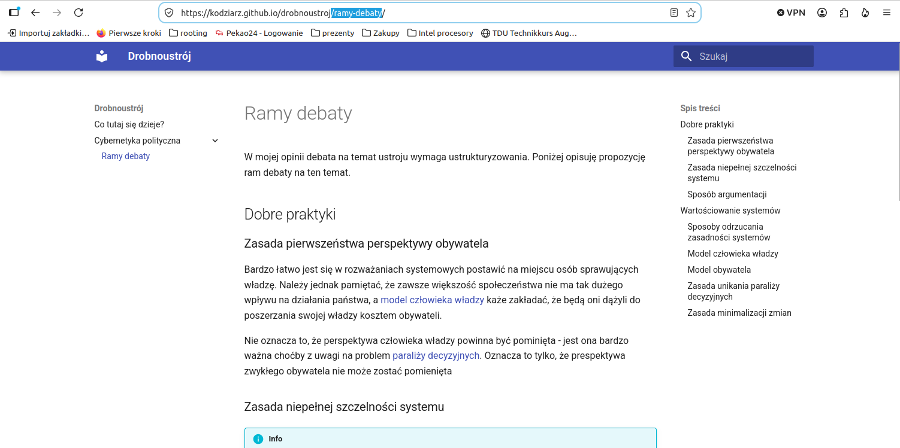

Po wprowadzeniu tych danych wystarczy kliknąć przycisk "Create". Na dzień dzisiejszy znajduje się on pod polem tekstowym na opis zgłoszenia, z prawej strony i jest zielony.

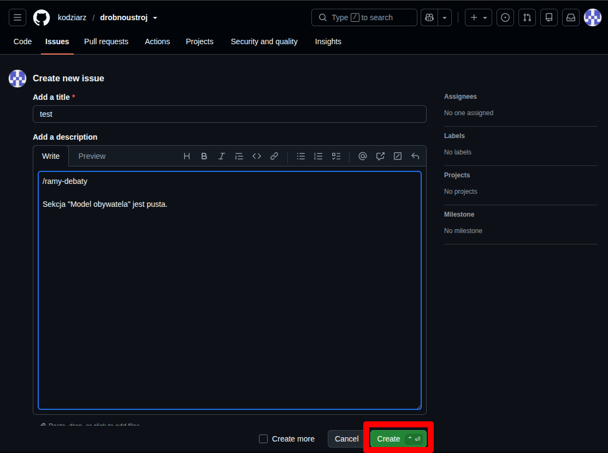

Po wszystkim powinna zostać wyświetlona strona zgłoszenia jak na obrazku poniżej. Oznacza to, że zgłoszenie zostało pomyślnie dodane.

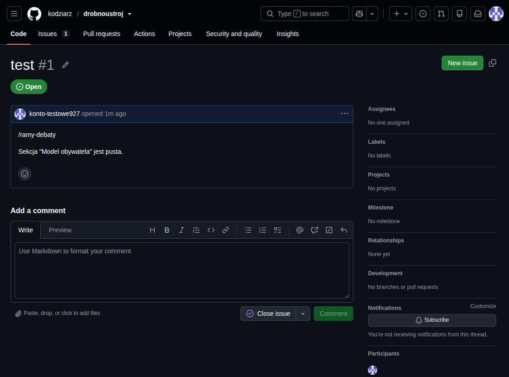

??? bug "TODO"
    Zakładanie konta pocztowego??